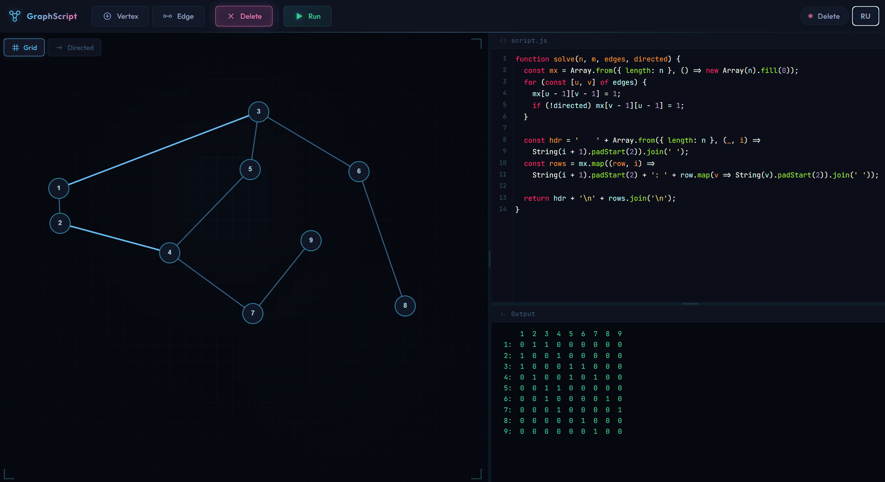

# Graph Script Editor

Рисуешь граф — пишешь алгоритм — смотришь результат. Всё в браузере, без установки.

<p align="center">
  
</p>

## Зачем

Когда нужно быстро проверить алгоритм на графе, не хочется каждый раз набивать ввод в терминале или рисовать на бумажке. Здесь граф строится мышкой, а скрипт запускается одной кнопкой.

Подходит для учёбы, олимпиадных задач и просто поиграться с графами.

## Что умеет

- Вершины и рёбра добавляются/удаляются кликами, нумерация всегда 1..n
- Переключение ориентированный/неориентированный граф
- Три языка для скриптов: JavaScript, C++, Python
- Рёбра пружинисто колеблются при перетаскивании вершин (физика нитей)
- Панели можно ресайзить, работает на тач-экранах
- Интерфейс на русском и английском

## Запуск

Сборка не нужна. Зависимости грузятся с CDN.

```bash
python -m http.server 8080
# открыть http://localhost:8080
```

## Как писать скрипты

Определи функцию `solve`:

```javascript
function solve(n, m, edges, directed) {
  // n        — количество вершин
  // m        — количество рёбер
  // edges    — массив пар [u, v], нумерация с 1
  // directed — true если граф ориентированный

  return n + ' вершин, ' + m + ' рёбер';
}
```

Результат появится в панели вывода. Больше примеров — в [EXAMPLES.md](EXAMPLES.md).

### Про языки

- **JavaScript** — выполняется в Web Worker прямо в браузере (таймаут 5 сек)
- **Python** — работает через [Pyodide](https://pyodide.org/) (WASM), первая загрузка медленная, дальше быстро (таймаут 30 сек)
- **C++** — компилируется удалённо через [Wandbox](https://wandbox.org/), код отправляется на их сервер (таймаут 15 сек)

## Стек

- [Cytoscape.js](https://js.cytoscape.org/) — визуализация графа
- [CodeMirror 5](https://codemirror.net/5/) — редактор кода
- Vanilla JS, без фреймворков и сборщиков

## Разработка

```bash
npm install              # зависимости (линтер, форматтер, тесты)
npm run lint             # ESLint
npm run format           # Prettier
npm test                 # e2e тесты (Playwright)
```

## Лицензия

[ISC](LICENSE)
